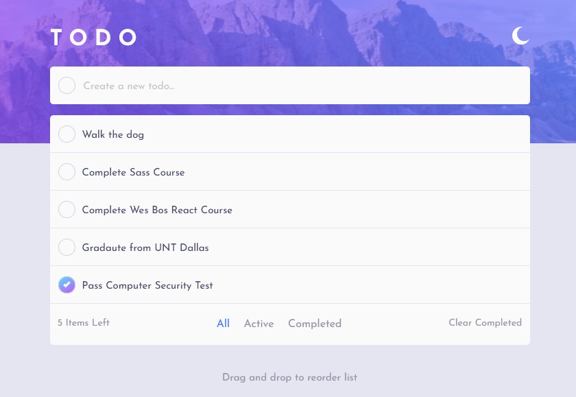
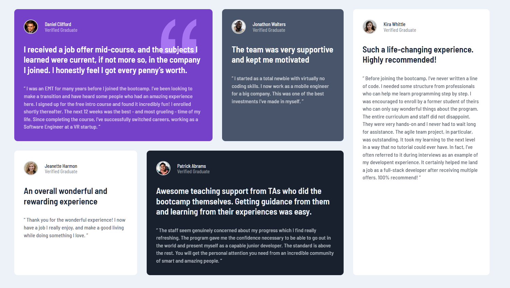

# Front End Mentor Challenges

This repository contains all the challenges that I have completed from the [FrontEndMentor challenges](https://www.frontendmentor.io/solutions). The challenges varied from creating simple components, pages, to small-scale applications.

Each challenge used various tools to complete, each section in this README contains the challenge name, description, tools used, image preview, a link to the challenge on FrontEndMentor, and a link to a live preview of my solution. If you have any questions, please feel free to contact me at jorgemendoza2002@gmail.com.

# Todo Application

A Todo application with drag and drop functionality (desktop only), locale storage, and a dark-mode toggle. The app was made with HTML, CSS, and JavaScript. Using CSS varaibles made it easier to switch out colors when dark mode is toggled by JS, when the toggle button is clicked a data attribute of "dark" was added to the body, and selector in CSS would change variable values depending on the data attribute set on the body.

The drag and drop capability was the biggest hurdle in this challenge. I seperated values and functions into seperate modules, one module would handle what the DOM manipulation and another module would handle the task data for the page. For example, when a user dragged and dropped a task on another task, the program grabbed data attributes from both elements, send them into a function that sorted these elements on the DOM, and then called a function from the data module that updated the array containing the task data as well.

[See Code](https://github.com/JorgeAMendoza/frontEndMentor_challenges/tree/main/todo-app-main) || [Live Preview](https://jorgeamendoza.github.io/frontEndMentor_challenges/todo-app-main/index.html) || [Link to Challenge](https://www.frontendmentor.io/solutions/todo-app-with-local-storage-support-and-dragdrop-desktop-xseKlfhRQ)

# Testimonial Grid Section

A simple grid layout created with HTML and CSS. On mobile the grid items stack on top of each other, but as the screen size increases, I apply a grid-area rule and adjust accordingly as the screen size increases. I Originally used span, but figured grid-area would simplify the process.

[See Code](https://github.com/JorgeAMendoza/frontEndMentor_challenges/tree/main/testimonials-grid-section-main) || [Live Preview](https://testimonials-grid-section-jorgeamendoza.vercel.app/) || [Link to Challenge](https://www.frontendmentor.io/solutions/testimonial-section-using-regular-css-w_iJna1eI)

# Crowfunding Product Page

A crowfunding page made wtih HTML, Sass, and JavaScript. When a user submits a pledge the page will update the project status and the quanity of backer rewards left. Since I didn't have access to some sort of database at the time I just grabbed the data from the page itself, in the future I plan to add locale storage support so the project status better emulates the feel of a crowfunding page.

[See Code](https://github.com/JorgeAMendoza/frontEndMentor_challenges/tree/main/crowdfunding-product-page-main) || [Live Preview](https://jorgeamendoza.github.io/frontEndMentor_challenges/crowdfunding-product-page-main/index.html) || [Link to Challenge](https://www.frontendmentor.io/challenges/crowdfunding-product-page-7uvcZe7ZR/hub/crowfunding-page-using-sass-71-architecture-YDpvcTk7K)

# FAQ Accordian Card

A FAQ card componenet made with HTML, CSS, and JavaScript. JavaScript was used to toggle the view of the answers to the questions on the page. I had not worked with position elements absolutely around a page, it really came down to trial-and-error to get it just right. The card is responsive as well, images and text will chagne position as the screen size changes.

[See Code](https://github.com/JorgeAMendoza/frontEndMentor_challenges/tree/main/faq-accordion-card-main) || [Live Preview](https://faq-accordian-card-jorgeamendoza.vercel.app/) || [Link to Challenge](https://www.frontendmentor.io/solutions/faq-accordian-card-with-regular-css-yoJMaGF7e)

# Social Media Card

A profile card component made with HTML and Sass, I used NPM to install Sass set a script up in the package.json file to watch the SCSS file as I worked. This was the easiest challenge from Front End Mentor so far, but it helped my review my knowledge on accessbility and helped me get used to using node-sass.

[See Code](https://github.com/JorgeAMendoza/frontEndMentor_challenges/tree/main/profile-card-component-main) || [Live Preview](https://www.frontendmentor.io/solutions/profile-card-component-with-regular-css-N7C0TtXZk) || [Link to Challenge](https://www.frontendmentor.io/solutions/profile-card-component-with-regular-css-N7C0TtXZk)
